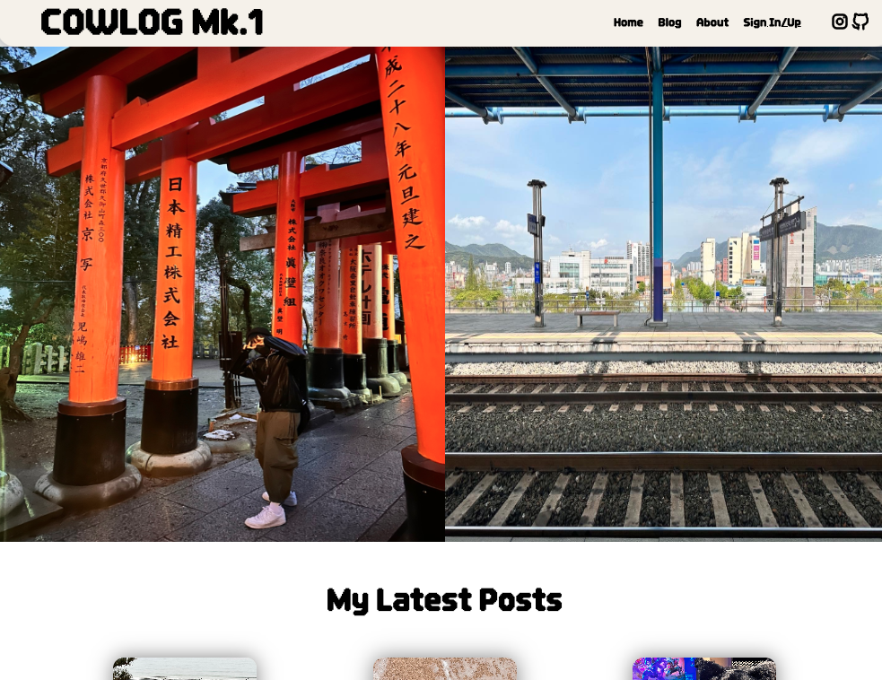
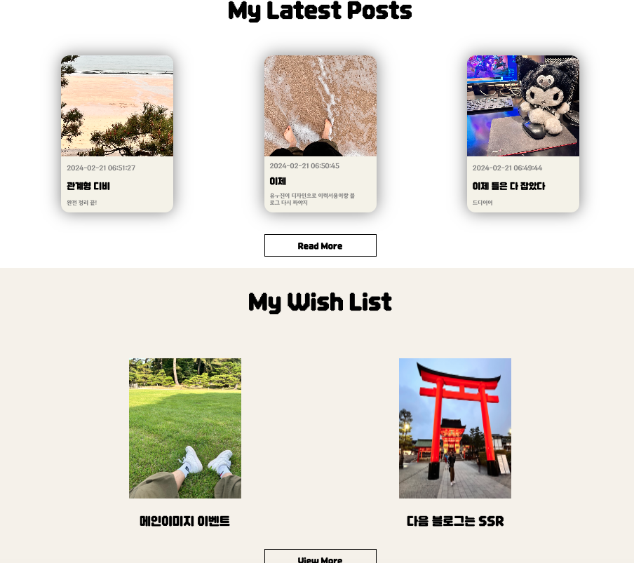
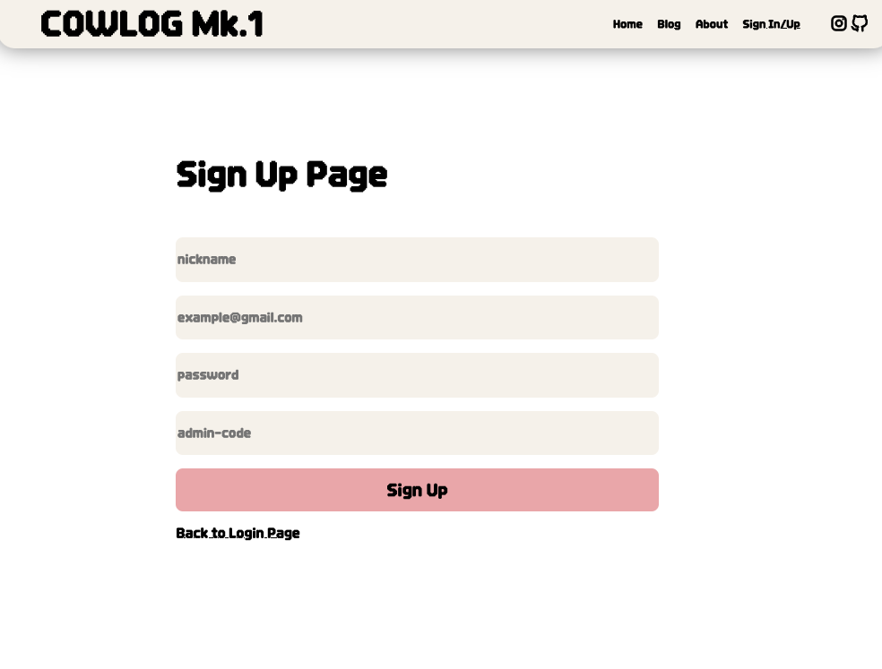
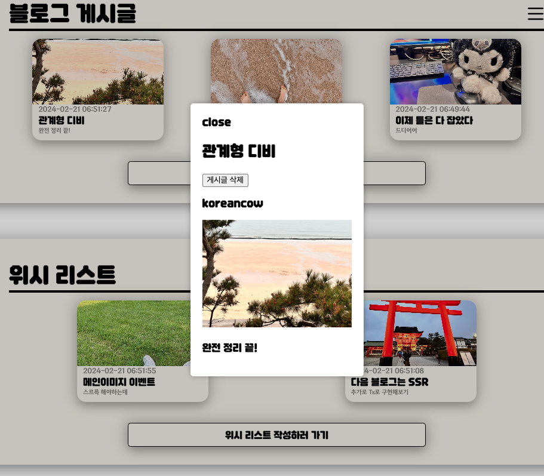
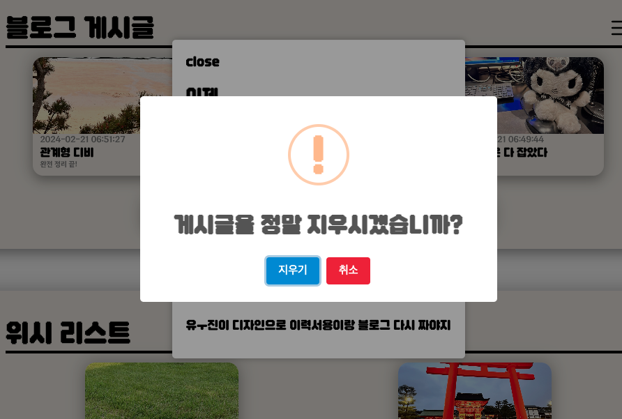

# CowLog Mk.1

현재까지의 공부내역 정리 겸 제작 / 배포 X

## 추가사항

- Next.js + Ts 응용하여 새로 구현 예정

## Figma

- https://www.figma.com/file/opuiDhJm1u4NdbPMbOzey8/CowLog?type=design&node-id=0-1&mode=design&t=qDwlkQe0ehBeQBDg-0

## 기술 스택

- Node.js | express
- React | redux
- Style | scss
- DB | MongoDB

### 블로그 이미지

 
 
 
 

